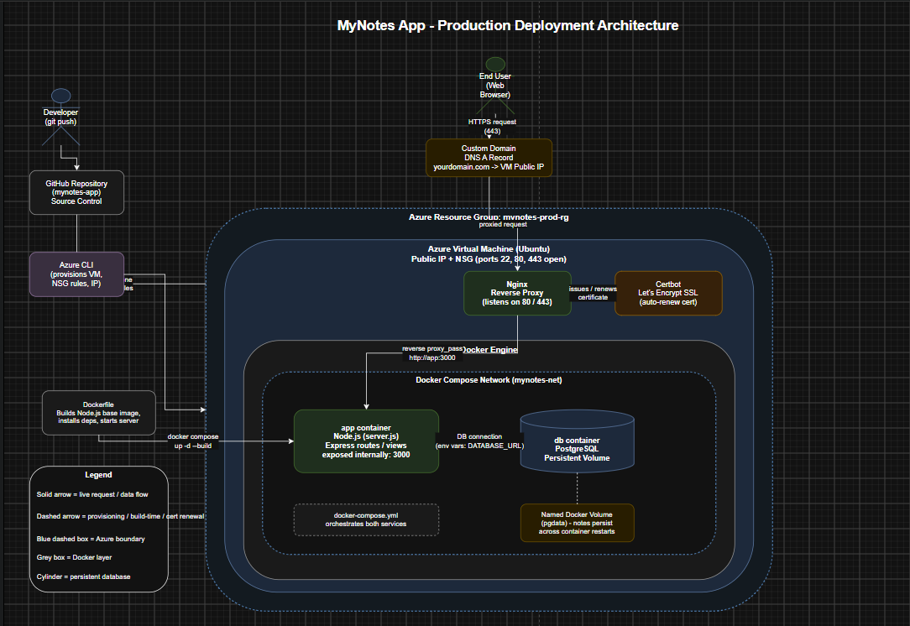
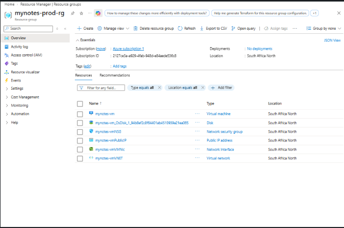
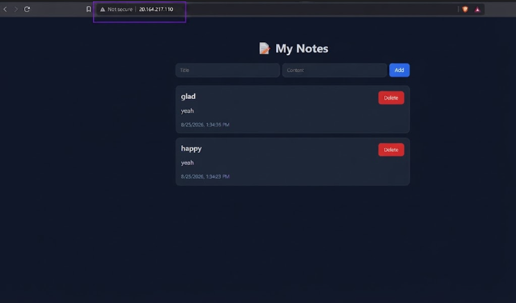
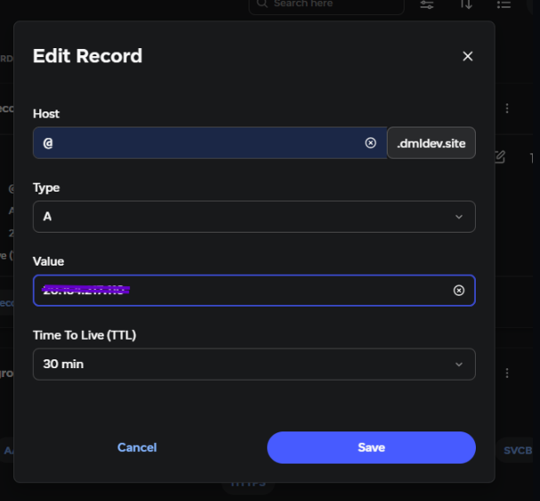
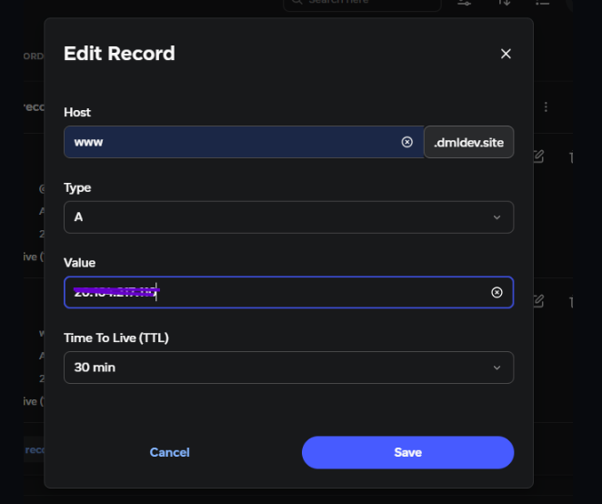
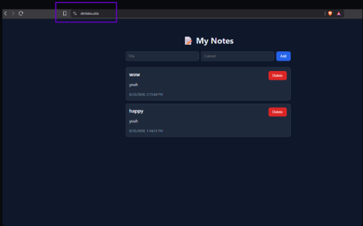
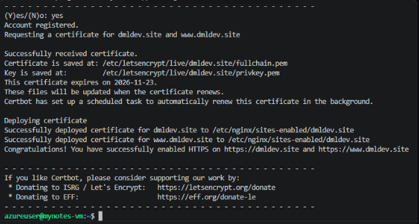

# MyNotes App

A simple notes application built with Node.js and Postgres, fully containerized with Docker and deployed to production on an Azure virtual machine. This repository documents not just the app itself, but the complete journey from a project running on localhost to a live, secured website reachable through a custom domain.

If you are looking to understand how a small web app actually gets from your laptop onto the internet, this project walks through that entire path, including the real issues encountered along the way.



## Project Overview

MyNotes is a lightweight notes app used here as the foundation for a hands on deployment exercise. Rather than focusing only on the application code, this project centers around packaging the app with Docker, provisioning cloud infrastructure on Azure, and setting up the surrounding pieces that make an app production ready. That includes a reverse proxy, a custom domain, and HTTPS.

The full step by step story behind this project is written up here:
[How I Deployed a Web App on Docker Using an Azure Virtual Machine](https://dmlops.hashnode.dev/how-i-deployed-a-web-app-on-docker-using-an-azure-virtual-machine-beginner-friendly-walkthrough)

## Technologies Used

This project brings together a small but practical stack of tools.

Node.js runs the application server.
PostgreSQL handles data storage.
Docker builds and runs the app in an isolated container.
Docker Compose coordinates the app and database containers together.
Nginx serves as a reverse proxy in front of the app.
Certbot issues and renews a free SSL certificate.
Azure CLI provisions and manages the virtual machine and networking rules.
Git and GitHub handle version control and source hosting.

## Project Structure

Here is a general overview of how the project is organized.

```
mynotes-app/
  Dockerfile              Instructions for building the app image
  docker-compose.yml      Defines the app and database services together
  server.js               Entry point for the Node.js application
  package.json             Project dependencies and scripts
  public/ or views/        Frontend assets and templates (if applicable)
  routes/ or controllers/  Application logic for handling notes
  .gitignore                Keeps node_modules and environment files out of version control
```

Your exact folder names may vary slightly depending on how the original Notes app was structured, but this gives a general sense of what lives where.

## Main Features

At its core, the project supports the everyday functions you would expect from a notes app, while the deployment setup around it adds a layer of real world infrastructure.

Create, view, and manage notes through the application.
Persistent storage using a Postgres database running in its own container.
Fully containerized setup so the app runs the same way on any machine.
Multi container orchestration through Docker Compose, keeping the app and database cleanly separated but connected.
Production style hosting on an Azure virtual machine rather than a local machine.
Reverse proxy configuration through Nginx, allowing the app to run on standard web ports instead of exposing a raw port number.
Free automatic SSL through Certbot, so the site loads securely over HTTPS.
Custom domain support, pointing a real domain name at the deployed app.

## Setup Instructions

Follow these steps to get the project running, either locally or on your own server.

### 1. Clone the repository

```bash
git clone https://github.com/dml-ops/mynotes-app.git
cd mynotes-app
```

### 2. Review the Dockerfile

The Dockerfile defines how the app image is built. It uses a lightweight Node.js base image, installs dependencies, and starts the server on port 3000.

### 3. Review the docker compose file

The docker-compose.yml file defines two services, the app itself and a Postgres database. Environment variables for the database connection are already set inside this file, so update them if you plan to use different credentials.

### 4. Build and start the containers

```bash
docker compose up -d --build
```

This builds the app image and starts both the app and database containers in the background.

### 5. Confirm everything is running

```bash
docker-compose ps
```

You should see both the app and db services listed as running.

### 6. View the app

If running locally, open your browser and go to:

```
http://localhost:3000
```

If running on a remote server, use the server's public IP address followed by port 3000, or your configured domain if a reverse proxy has already been set up.

## Workflow Usage Guide

Once the containers are running, using the app is straightforward.

Open the app in your browser using the address from the setup steps above.
Create a new note through the interface provided by the app.
Notes are saved to the Postgres database running inside its own container, so your data persists even if the app container restarts.
To stop the containers, run `docker compose down` from the project directory.
To view logs for troubleshooting, run `docker compose logs -f`.

If you are deploying this to your own server rather than running it locally, the Hashnode walkthrough linked above covers provisioning an Azure virtual machine, transferring project files with scp, setting up Nginx as a reverse proxy, pointing a domain name at the server, and securing everything with SSL through Certbot.

## Screenshots

Below are placeholders for the key screenshots referenced in the deployment walkthrough. Add your own images to an `assets` or `screenshots` folder and update the paths accordingly.













## A Final Note

This project was as much about the process as it was about the app itself. Along the way there were a couple of real hiccups worth mentioning, including a case where the virtual machine could not find the project files because only the configuration had been created directly on the server, and needing to install the Azure CLI on the VM itself before certain networking commands would work. Working through issues like these ended up being one of the more useful parts of the whole exercise.

If you are working through a similar deployment or are new to Docker and Azure, the full walkthrough with detailed explanations at every step is available here:
[How I Deployed a Web App on Docker Using an Azure Virtual Machine](https://dmlops.hashnode.dev/how-i-deployed-a-web-app-on-docker-using-an-azure-virtual-machine-beginner-friendly-walkthrough)